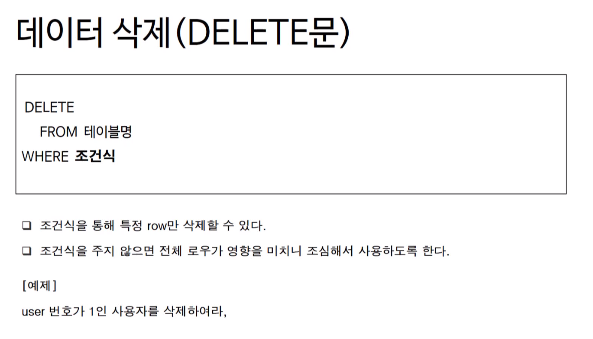
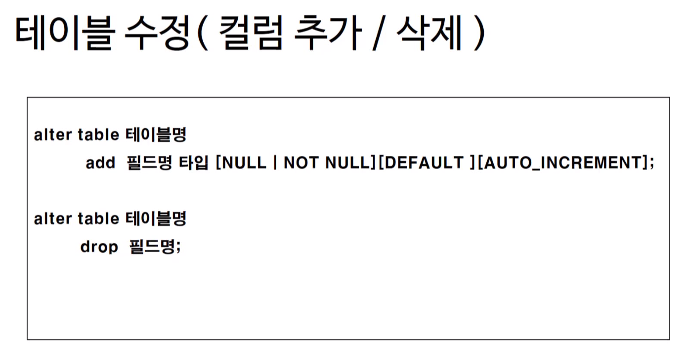
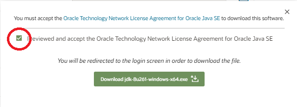
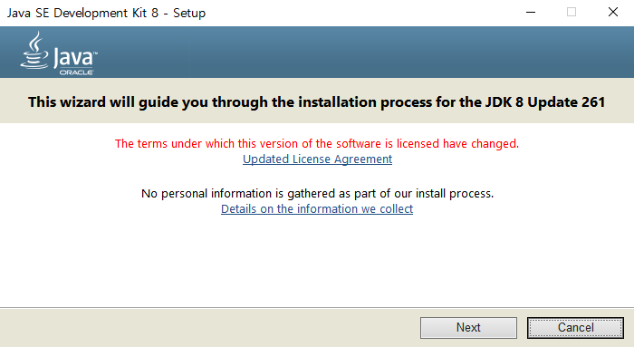
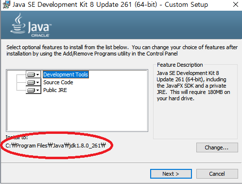
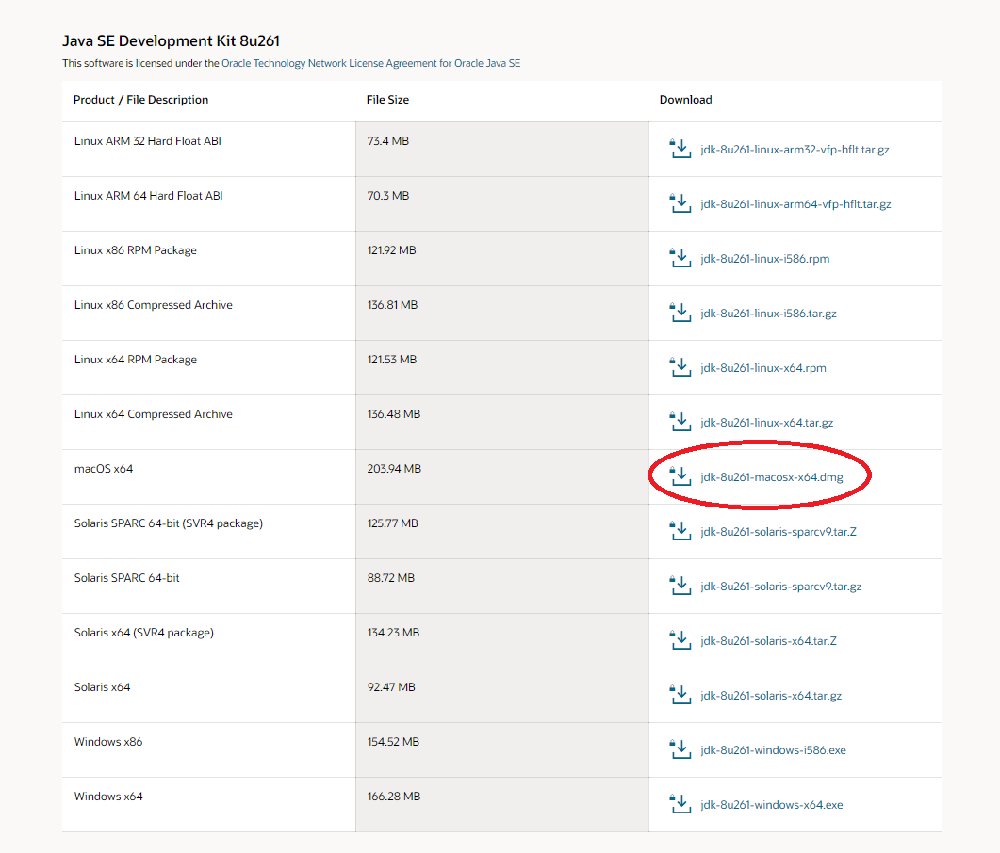
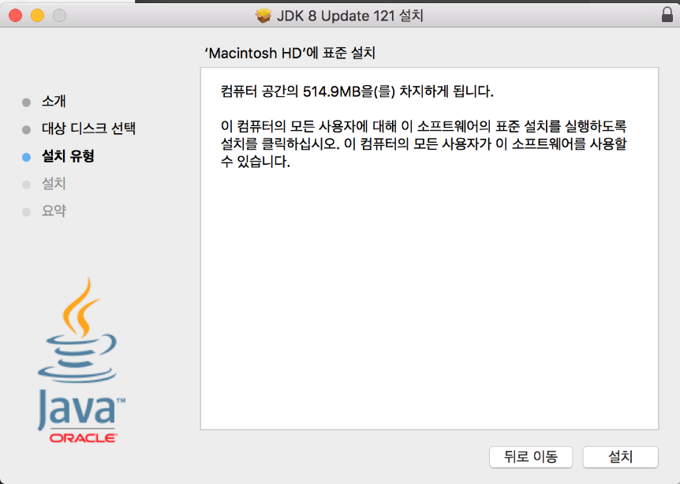
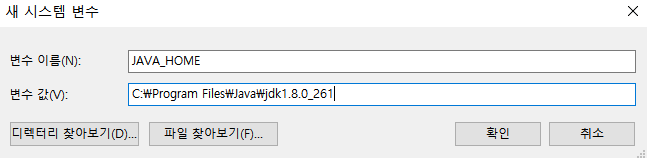
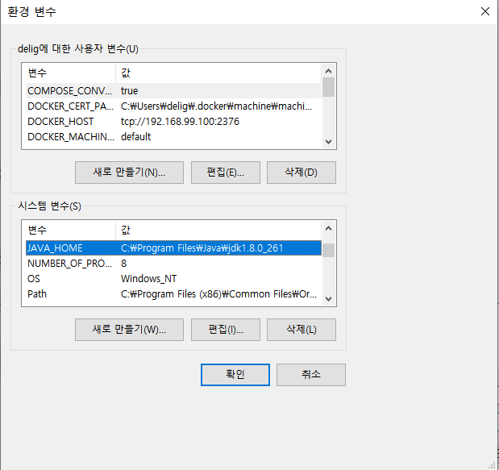
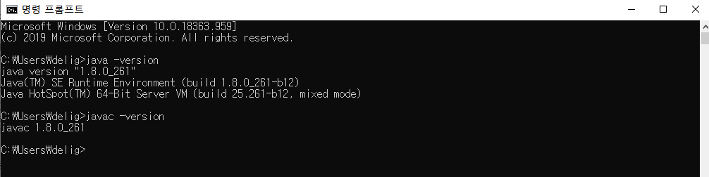

# SQL & JDBC 프로그래밍

# 1. MySQL

## 1) inrto

### 1. 데이터베이스의 기본 개념 (정의)

- 데이터의 집합 (a Set of Data)
- 여러 응용 시스템(프로그램)들의 통합된 정보들을 저장하여 운영할 수 있는 공용(share) 데이터의 집합
- 효율적으로 저장, 검색, 갱신할 수 있도록 데이터 집합들끼리 연관시키고 조직화되어야 한다.


### 2. 데이터베이스의 특성

- 실시간 접근성(Real-time Accessability)

  : 사용자의 요구를 즉시 처리할 수 있다.

- 계속적인 변화(Continuous Evolution)

  : 정확한 값은 유지하려고 삽입, 삭제, 수정 작업 등을 이용해 데이터를 지속적으로 갱신할 수 있다.

- 동시 공유성(Concurrent Sharing)

  : 사용자마다 서로 다른 목적으로 사용하므로 동시에 여러 사람이 동일한 데이터에 접근하고 이용할 수 있다.

- 내용 참조(Content Reference)

  : 저장한 데이터 레코드의 위치나 주소가 아닌 사용자가 요구하는 데이터의 내용, 즉 데이터 값에 따라 참조할 수 있어야 한다.


### 3. 데이터 베이스 관리 시스템(Database Management System = DBMS)

- 데이터베이스를 관리하는 소프트웨어
- 여러 응용 소프트웨어(프로그램) 또는 시스템이 동시에 데이터베이스에 접근하여 사용할 수 있게 한다.
- 필수 3기능
  - 정의기능 : 데이터 베이스의 논리적, 물리적 구조를 정의
  - 조작기능 : 데이터를 검색, 삭제, 갱신, 삽입하는 기능
  - 제어기능 : 데이터베이스의 내용 정확성과 안전성을 유지하도록 제어하는 기능
- Oracle, SQL Server, MySQL, DB2 등의 상용 또는 공개 DBMS가 있다.


### 4. 데이터 베이스 관리 시스템 장/단점

- 장점
  - 데이터 중복이 최소화
  - 데이터의 일관성 및 무결성 유지
  - 데이터 보안 보장
- 단점
  - 운영비가 비싸다
  - 백업 및 복구에 대한 관리가 복잡
  - 부분적 데이터베이스 손실이 정체 시스템을 정지


### * 참고 자료

[DBMS 참고링크](https://ko.wikipedia.org/wiki/%EB%8D%B0%EC%9D%B4%ED%84%B0%EB%B2%A0%EC%9D%B4%EC%8A%A4_%EA%B4%80%EB%A6%AC_%EC%8B%9C%EC%8A%A4%ED%85%9C)


## 2) MySQL 다운로드 및 설치

### 1. Windows에서 MySQL 설치하기

[MySQL 설치 프로그램 다운로드](https://www.mysql.com/downloads/)

위의 URL 주소로 접속합니다.


접속하면 하단에 위와 같은 링크가 보여집니다.

`Community(GPL) Downloads`를 클릭합니다.


다시 화면이 바뀌고, 하단에서 위와 같은 부분을 찾습니다.

`MySQL Community Server Download` 링크를 클릭합니다.


본인이 사용하는 윈도우에 맞는 버전을 선택합니다.

그리고 나서 `Go to Download Page` 버튼을 클릭합니다.


위와 같은 화면으로 전환되면 붉은 사각형으로 처져 있는 `Download` 버튼을 클릭합니다.


로그인을 하지 않고 다운로드 하려면 `No thanks, just start my download` 링크를 클릭합니다.

MySQL Community Edition이 이제 다운로드 됩니다.

mysql-installer-community-5.7.21.0.msi를 실행합니다.


설치 프로그램을 실행하면 가장 먼저 라이선스에 대해서 물어보는 화면이 보입니다.

라이선스 동의 체크박스를 선택한 후 `Next` 버튼을 클릭합니다.


`Developer Default`를 선택한 후 `Next` 버튼을 클릭합니다.

말 그대로 개발자를 위한 MySQL을 설치하겠다는 것입니다.

개발자를 위한 다양한 도구들이 함께 설치가 됩니다.


위와 같은 화면이 보이면, `Execute` 버튼을 클릭하여 설치를 진행합니다.


MySQL이 설치되고 실행되기 위해서 필요한 도구들에 대해서 `Execute`를 눌러 설치한 후 `Next` 버튼을 클릭합니다.


설치할 항목이 표시됩니다.

`Execute` 버튼을 클릭하여 설치를 시작합니다.


설치가 모두 진행되었다면 `Next` 버튼을 클릭합니다.


MySQL과 관련된 설정 과정이 진행된다는 안내가 표시됩니다.

`Next` 버튼을 클릭합니다.

root 계정의 암호를 설정하는 부분까지 기본값으로 설치를 진행합니다.


MySQL의 `관리자(root) 계정의 암호`를 설정합니다.

암호를 잊지 않게 조심해 주세요.

암호를 입력했다면 `Next` 버튼을 클릭합니다.

커넥션 연결 테스트를 진행할 때까지 기본값으로 설치를 진행하도록 하겠습니다.


MySQL이 잘 실행되고 있는지 확인하기 위한 화면입니다.

앞에서 입력했던 root 사용자의 암호를 입력하고 `Check` 버튼을 클릭합니다.

위와 같이 연결 성공이라는 녹색화면이 보이면 `Next` 버튼을 클릭합니다.


모든 설치 과정이 끝났습니다.

`Finish` 버튼을 클릭합니다.


모든 인스톨 과정이 완료되었습니다.

`Finish` 버튼을 클릭하면 MySQL Workbench와 MySQL Shell이 실행될 것이라는 체크박스가 선택되어 있습니다.

`Finish` 버튼을 클릭합니다.


MySQL Workbench 실행화면입니다.


MySQL Shell 실행화면입니다.

앞으로 MySQL을 이용해서 개발을 진행할 때 워크벤치나 MySQL 쉘을 이용해야 하는 경우가 많이 발생할 것입니다.

창을 닫고, 프로그램을 종료해주세요.


윈도우 메뉴를 보면 MySQL 그룹이 새로 생긴 것을 볼 수 있습니다.

위의 그림중에서 붉은 상자로 되어 있는 부분이 워크벤치와 MySQL Shell을 실행하기 위한 아이콘입니다.

뒤에서 MySQL을 사용할 때 위의 아이콘을 선택하시면 됩니다.

콘솔창에서 mysql 명령을 실행하려면, 다음의 경로를 PATH에 지정하세요.

윈도우 검색창에 `환경`이라고 입력합니다.


`시스템 환경 변수 편집`이라는 프로그램이 보이면 클릭해서 실행합니다.


위와 같은 시스템 속성창이 열리면 아래 쪽의 `환경 변수` 버튼을 클릭합니다.


시스템 변수 중에서 Path를 선택하고, `편집` 버튼을 클릭합니다.


`새로 만들기` 버튼을 클릭한 후, 아래의 path를 입력한 후 `확인` 버튼을 클릭합니다.

이전 창도 모두 `확인` 버튼을 눌러 닫습니다.

`C:\Program Files\MySQL\MySQL Server 5.7\bin`

이제 콘솔창에서 mysql 명령을 수행할 수 있습니다.


### 2. Mac에서 MySQL 설치하기

#### 2.1. HomeBrew 설치하기

먼저 맥에 `HomeBrew`가 설치되어 있어야 합니다.

터미널에서 아래 명령어를 통해 HomeBrew가 설치되어 있는지 확인해볼 수 있습니다.

```shell
brew -v
```

만약 HomeBrew가 기존에 설치된 상태라면 버전 정보를 확인해볼 수 있습니다.

```shell
HomeBrew 1.5.0

HomeBrew/homebrew-core (git revision ce185; last commit 2018-01-20)

```

만약 버전 정보가 제대로 나오지 않는다면 먼저 `HomeBrew` 설치를 먼저 해주세요.

HomeBrew 설치법은 [https://brew.sh](https://brew.sh) 사이트 설명을 참고하시면 됩니다.

설치법이 간단하고 한국어 설명도 지원하기 때문에 쉽게 할 수 있습니다.

#### 2.2. HomeBrew를 이용한 MySQL 설치하기

HomeBrew를 이용하면 쉽게 설치할 수 있고, 환경변수를 설정할 필요도 없습니다.

Oracle사에서 직접 다운로드하여 설치하는 것보다 훨씬 쉽게 설치하고 사용할 수 있습니다.

```shell
brew install mysql
```

위의 문장을 입력하면 다음과 같은 화면이 출력되고 설치가 완료됩니다.


### * 참고 자료

[Installing and Upgrading MySQL](https://dev.mysql.com/doc/refman/5.7/en/installing.html)

[MySQL 8.x 설치하기](https://dog-developers.tistory.com/20)


## 3) MySQL 실행

### 1. MS Windows 10


윈도우 검색 버튼에서 `서비스`라고 입력하면 `서비스(데스크톱 앱)`이라는 프로그램이 보입니다.

해당 프로그램을 선택하세요.


위와 같이 `MySQL57`이라는 이름으로 서비스가 실행된 것을 알 수 있습니다.

참고로 MySQL이 설치될 때 유심히 봤다면 MySQL57이라는 서비스 이름으로 서비스가 실행된다는 메시지가 보입니다.

시작 유형은 자동으로 되어있기 때문에, 윈도우가 실행될 때 자동으로 서버가 서비스 형태로 실행됩니다.

나중에, MySQL이 동작하지 않는다면 해당 서비스에서 `실행 중`이라고 표시되는지 확인해주세요.


### 2. Mac

HomeBrew를 이용해서 MySQL을 설치했다면, 실행과 중지가 상당히 간편합니다.

환경 변수 설정 등이 모두 자동으로 이뤄지기 때문입니다.

#### 2.1. MySQL 서버 실행하기

mysql 서버를 실행하려면 터미널을 실행해 주신 후 아래와 같이 명령을 실행해 주세요.

```shell
mysql.server start
```

위의 명령을 내리면 아래와 같은 메시지가 실행됩니다.

```shell
Starting MySQL
.SUCCESS!
```

#### 2.2. MySQL을 데몬으로 실행하기

운영체제의 백그라운드로 MySQL이 계속 실행되도록 하고 싶다면 `HomeBrew`가 제공하는 명령을 이용하면 됩니다.

`HomeBrew`로 다음과 같이 mysql 데몬을 실행합니다.

아래와 같이 명령을 수행하면 간단하게 mysql을 데몬형태로 실행할 수 있습니다.

```shell
brew services start mysql
```

서비스 재시작도 HomeBrew가 제공하는 명령을 이용하면 됩니다.

아래와 같이 명령을 수행하세요.

```shell
brew services restart mysql
```

데몬으로 실행되고 있는 프로그램들이 궁금하다면 아래와 같이 명령을 실행하면 됩니다.

```shell
brew services list
```


### * 참고 자료

[Installing and Upgrading MySQL](https://dev.mysql.com/doc/refman/5.7/en/installing.html)


## 4) MySQL 종료

### 1. Windows에서 MySQL 서버 종료하기

윈도우에서 MySQL 서버를 종료하는 것은 간단합니다.


서비스 목록에서 `MySQL57`을 선택한 후 우측버튼을 클릭합니다.

우측버튼을 클릭했다면 `속성` 버튼을 클릭합니다.


속성 창에서 `중지` 버튼을 클릭하면 MySQL 서버는 정지됩니다.

만약, 윈도우가 실행될 때 자동으로 실행되길 원하지 않는다면, 시작 유형 `자동`을 `수동`으로 변경한 후 `확인` 버튼을 클릭하면 됩니다.

이 경우에는 위의 유형 창에서 `시작` 버튼을 매번 눌러줘야 MySQL 서버가 실행됩니다.


### 2. Mac에서의 MySQL 종료하기

```shell
mysql.server start
```

터미널에서 위의 명령으로 서버를 실행했다면

```shell
mysql.server stop
```

위의 명령으로 서버를 종료할 수 있습니다.

```shell
Shutting down MySQL

..SUCCESS!
```

MySQL이 종료되면서 위와 같은 메시지가 보여집니다.

만약 `HomeBrew`를 이용해서 다음과 같이 데몬으로 실행했다면

```shell
brew services start mysql
```

다음과 같은 명령으로 데몬 형태로 실행되고 있는 MySQL을 종료할 수 있습니다.

```shell
brew service stop mysql
```


### * 참고 자료

[Installing and Upgrading MySQL](https://dev.mysql.com/doc/refman/5.7/en/installing.html)


# 2. SQL

## 1) SQL이란?

### 1. SQL(Structured Query Language)

- SQL은 데이터를 보다 쉽게 검색하고 추가, 삭제, 수정 같은 조작을 할 수 있도록 고안된 컴퓨터 언어입니다.
- 관계형 데이터베이스에서 데이터를 조작하고 쿼리하는 표준 수단입니다.
- `DML (Data Manipulation Language)` : 데이터를 조작하기 위해 사용합니다.
  INSERT, UPDATE, DELETE, SELECT 등이 여기에 해당합니다.
- `DDL (Data Definition Language)` : 데이터베이스의 스키마를 정의하거나 조작하기 위해 사용합니다.
  CREATE, DROP, ALTER 등이 여기에 해당합니다.
- `DCL (Data Control Language)` : 데이터를 제어하는 언어입니다.
  권한을 관리하고, 테이터의 보안, 무결성 등을 정의합니다.
  GRANT, REVOKE 등이 여기에 해당합니다.

 

### 2. Database 생성하기

콘솔에서 다음과 같이 명령을 실행합니다.

MySQL 관리자 계정인 root로 데이터베이스 관리 시스템에 접속하겠다는 것입니다.

```cmd
mysql –uroot  -p
```

window 사용자는 설치 시에 입력했던 암호를 입력합니다.

맥 사용자는 암호가 없으니 그냥 엔터를 입력하면 됩니다.

MySQL DBMS에 접속하면 “mysql>” 프롬프트가 보입니다.


#### Database 생성하기

관리자 계정으로 MySQL에 접속했다면, 다음과 같은 명령으로 데이터베이스를 생성합니다.

```mysql
 mysql> create database DB이름;
```

우리는 다음과 같은 명령을 실행하여 DB이름을 “connectdb＂로 생성하도록 하겠습니다.

```mysql
mysql> create database connectdb;
```


### 3. Database 사용자 생성과 권한 주기

- Database를 생성했다면, 해당 데이터베이스를 사용하는 계정을 생성해야 합니다.
- 또한, 해당 계정이 데이터베이스를 이용할 수 있는 권한을 줘야 합니다.
- 아래와 같은 명령을 이용해서 사용자 생성과 권한을 줄 수 있습니다.
- db이름 뒤의 * 는 모든 권한을 의미합니다.
- @’%’는 어떤 클라이언트에서든 접근 가능하다는 의미이고, @’localhost’는 해당 컴퓨터에서만 접근 가능하다는 의미입니다.
- `flush privileges`는 DBMS에게 적용을 하라는 의미입니다. 해당 명령을 반드시 실행해줘야 합니다.

> mysql 8버전에서는 create user를 먼저 해주고 grant를 해주셔야 합니다.

```mysql
grant all privileges on db이름.* to 계정이름@'%' identified by ＇암호';
grant all privileges on db이름.* to 계정이름@'localhost' identified by ＇암호’;
flush privileges;
```

- 사용자 계정이름은 'connectuser', 암호는 'connect123!@#', 해당 사용자가 사용하는 데이터베이스는 'connectdb'로 계정을 생성하려면 다음과 같이 명령을 수행합니다.

```mysql
grant all privileges on connectdb.* to connectuser@'%' identified by 'connect123!@#';

grant all privileges on connectdb.* to connectuser@'localhost' identified by 'connect123!@#';

flush privileges;
```


#### MySQL 8.0

- mysql 8버전에서는 `create user`를 먼저 해주고 `grant`를 해주셔야 합니다.

```mysql
create user '계정이름'@'localhost' identified by '암호';
grant all privileges on db이름.* to '계정이름'@'localhost' with grant option;
flush privileges;
```

- 사용자 계정이름은 'connectuser', 암호는 'connect123!@#', 해당 사용자가 사용하는 데이터베이스는 'connectdb'로 계정을 생성하려면 다음과 같이 명령을 수행합니다.

```mysql
create user 'connectuser'@'localhost' identified by 'connect123!@#';

grant all privileges on *.* to 'connectuser'@'localhost' with grant option;

flush privileges;
```


### 4. 생성한 Database에 접속하기

아래와 같이 명령을 실행하여 원하는 데이터베이스에 접속할 수 있습니다.

```mysql
mysql –h호스트명 –uDB계정명 –p 데이터베이스이름
```

db이름이 connectdb, db계정이 connectuser, 암호가 connect123!@# 일 경우 콘솔창에서 다음과 같이 입력합니다.

```mysql
mysql –h127.0.0.1 –uconnectuser –p connectdb [enter]
```


- 다음과 같이 프롬프트가 보이면 성공


### 5. MySQL 연결끊기

프롬프트에서 `quit`혹은 `exit`라고 입력합니다.

```mysql
mysql> quit
mysql> exit
```


- 다음과 같이 Bye라고 나오면 연결 끊기 성공


### 6. SQL 입력하기

#### 6.1. MySQL 버전과 현재 날짜 구하기

```mysql
mysql> SELECT VERSION(), CURRENT_DATE;
+-----------+--------------+
| VERSION() | CURRENT_DATE |
+-----------+--------------+
| 5.1.67    | 2013-01-05   |
+-----------+--------------+
1 row in set (0.00 sec)
```

프롬프트에서는 SQL을 입력합니다.

SQL은 semicolon (;)으로 끝납니다.

SQL은 쿼리(Query)라고 읽습니다.

쿼리는 DBMS에게 명령을 내릴 때 사용하는 문장이라고 생각하면 쉽습니다.

SELECT는 어떤 내용을 조회할 때 사용하는 키워드입니다.

MySQL은 쿼리에 해당하는 결과의 전체 row를 출력하고 마지막에 전체 row 수와 쿼리실행에 걸린 시간을 표시합니다.

#### 6.2. 키워드는 대소문자를 구별하지 않는다.

다음 쿼리들은 모두 같습니다.

```mysql
mysql> SELECT VERSION(), CURRENT_DATE;
mysql> select version(), current_date;
mysql> SeLeCt vErSiOn(), current_DATE;
```

#### 6.3. 쿼리를 이용해서 계산식의 결과도 구할 수 있다.

 함수 및 수식 사용 예제

```mysql
mysql> SELECT SIN(PI()/4), (4+1)*5;
+-------------+---------+
| SIN(PI()/4) | (4+1)*5 |
+-------------+---------+
|    0.707107 |      25 |
+-------------+---------+
```

#### 6.4. 여러 문장을 한 줄에 연속으로 붙여서 실행가능하다.

각 문장에 `semicolon(;)`만 붙혀 주면 됩니다.

```mysql
mysql> SELECT VERSION(); SELECT NOW();
+--------------+
| VERSION()    |
+--------------+
| 3.22.20a-log |
+--------------+
+---------------------+
| NOW()               |
+---------------------+
| 2004 00:15:33 |
+---------------------+
```

#### 6.5. 하나의 SQL은 여러 줄로 입력가능하다.

MySQL은 문장의 끝을 라인으로 구분하는 것이 아니라 `semicolon(;)`으로 구분하기 때문에 여러 줄에 거쳐 문장을 쓰는 것도 가능합니다.

```mysql
mysql> SELECT
    -> USER()
    -> ,
    -> CURRENT_DATE;
+--------------------+--------------+
| USER()             | CURRENT_DATE |
+--------------------+--------------+
| joesmith@localhost | 1999-03-18   |
+--------------------+--------------+
```

#### 6.6. SQL을 입력하는 도중에 취소할 수 있다.

긴 쿼리를 작성하다가 중간에 취소해야 하는 경우에는 즉시 `\c`를 붙혀주면 됩니다.

```mysql
mysql> SELECT

    -> USER()

    -> \c

mysql>
```

#### 6.7. DBMS에 존재하는 데이터베이스 확인하기

작업하기 위한 데이터베이스를 선택하기 위해서는 어떤 데이터베이스가 존재하는지 알아보아야 합니다.

현재 서버에 존재하는 데이터베이스를 찾아보기 위해서 `show` statement을 사용합니다.

```mysql
mysql> show databases;
+-----------------------+
| Database               |
+-----------------------+
| information_schema |
| connectdb              |
+-----------------------+
2 rows in set (0.00 sec)
```

#### 6.8. 사용중인 데이터베이스 전환하기

데이터베이스를 선택하기 위해, `use` command를 사용합니다.

```mysql
mysql> use mydb;
```

데이터베이스를 전환하려면, 이미 데이터베이스가 존재해야 하며 현재 접속 중인 계정이 해당 데이터베이스를 사용할 수 있는 권한이 있어야 합니다.


### 7. 데이터를 저장하는 공간 테이블(Table)

- 마이크로소프트의 엑셀(Excel)을 실행하면 표가 나옵니다. 이러한 표에 각종 값을 저장할 수 있습니다.
- 데이터베이스도 엑셀의 표와 유사한 테이블을 가질 수 있습니다.
- 엑셀과 다른 점은 데이터베이스를 생성해도 테이블은 존재하지 않는다는 것입니다.
- 테이블을 사용하려면 테이블을 생성하는 SQL을 사용해야 합니다.
- 그리고, 테이블에 값을 저장하려면 저장하기 위한 SQL을 사용해야 합니다.

- **테이블(table)의 구성요소**
  - 테이블 : RDBMS의 기본적 저장구조 한 개 이상의 column과 0개 이상의 row로 구성합니다.
  - 열(Column) : 테이블 상에서의 단일 종류의 데이터를 나타냄. 특정 데이터 타입 및 크기를 가지고 있습니다.
  - 행(Row) : Column들의 값의 조합. 레코드라고 불림. 기본키(PK)에 의해 구분. 기본키는 중복을 허용하지 않으며 없어서는 안 됩니다.
  - Field : Row와 Column의 교차점으로 Field는 데이터를 포함할 수 있고 없을 때는 NULL 값을 가지고 있습니다.


#### 7.1. 현재 데이터베이스에 존재하는 테이블 목록 확인하기

Database를 선택 후, Database의 전체 테이블 목록을 출력합니다.

```mysql
mysql> show tables;

Empty set (0.02 sec)
```

`empty set`은  데이터베이스에 어떤 테이블도 아직 생성되지 않았다는 것을 알려줍니다.

#### 7.2. SQL 연습을 위한 테이블 생성과 값의 저장

examples.sql을 다운로드 합니다. [링크 바로가기](https://www.edwith.org/downloadFile/fileDownload?attachmentId=304830&autoClose=true)

터미널에서 examples.sql이 있는 폴더로 이동한 후, 다음과 같이 명령을 수행합니다.

명령을 수행한 후 암호를 입력합니다.

```cmd
mysql -uconnectuser -p connectdb < examples.sql
```

examples.sql에는 연습을 위한 테이블 생성문과 해당 테이블에 값을 저장하는 입력문이 존재합니다.

```cmd
mysql –uconnectuser -p connectdb
```

위의 명령으로 connectdb에 접속한 후 다음과 같이 명령을 수행합니다.

```mysql
mysql> show tables;
```

위의 명령은 접속한 db의 테이블 목록을 보는 명령입니다.


#### 7.3. 테이블 구조를 확인하기 위한 DESCRIBE 명령

table 구조를 확인하기 위해, `DESCRIBE` 명령을 사용할 수 있습니다.

짧게 `DESC`라고 사용해도 됩니다.

EMPLOYEE테이블의 구조를 확인해 봅시다.

```mysql
mysql> desc EMPLOYEE;
```


### * 참고 자료

[SQL이란 무엇인가](http://www.ciokorea.com/print/35385)

[13.1.11 CREATE DATABASE Syntax ver8.0](https://dev.mysql.com/doc/refman/8.0/en/create-database.html)

[13.7.1.4 GRANT Syntax ver8.0](https://dev.mysql.com/doc/refman/8.0/en/grant.html)

[13.2.9 SELECT Syntax ver8.0](https://dev.mysql.com/doc/refman/8.0/en/select.html)

[MySQL Workbench 사용](https://opentutorials.org/course/3161/19548)


## 2) DML(select, insert, update, delete)

### 1. 데이터 조작어(Data Manipulation Language, DML)의 종류

데이터 조작어는 모두 동사로 시작합니다.

시작하는 동사에 따라서 다음과 같은 4가지 조작어가 있습니다.

- SELECT – 검색
- INSERT - 등록
- UPDATE - 수정
- DELETE - 삭제


### 2. SELECT (데이터 검색)

#### 2.1. SELECT 구문의 기본문형


##### 2.1.1. 전체 데이터 검색

- SELECT 뒤에 `*` 를 기술함으로써 나타낼 수 있습니다.

- 예제 : departments 테이블의 모든 데이터를 출력하시오.

```markup
  SELECT * FROM  DEPARTMENT;
```


##### 2.1.2. 특정 컬럼 검색

- SELECT 뒤에 컬럼을 `콤마(,)`로 구별해서 나열합니다.

- 예제 : employee 테이블에서 직원의 사번(empno), 이름(name), 직업(job)을 출력하시오.

> 어떤 칼럼이 있는지는 `desc`명령으로 확인할 수 있습니다.

```markup
select empno, name, job from employee;
```


##### 2.1.3. 컬럼에 Alias 부여하기

- 컬럼에 대한 ALIAS(별칭)을 부여해서 나타내는 칼럼의 HEADING을 변경할 수 있습니다.
- 컬럼 뒤에 `as`나 `공백`을 사용합니다.
- ALIAS에 공백이 포함될 경우 `''`로 감싸줍니다.

- 예제 : employee 테이블에서 직원의 사번(empno), 이름(name), 직업(job)을 출력하시오.

```markup
select empno as 사번, name as 이름, job as 직업 from employee;
select empno 사번, name 이름, job 직업 from employee;
```


##### 2.1.4. 컬럼의 합성(Concatenation)

- 문자열 결합함수 `concat`를 사용합니다.

- 예제 : employee 테이블에서 사번과 부서번호를 하나의 칼럼으로 출력하시오.

```markup
SELECT concat( empno, '-', deptno) AS '사번-부서번호' FROM employee;
```


##### 2.1.5. 중복행의 제거

- 중복되는 행이 출력되는 경우, `DISTINCT `키워드로 중복행을 제거할 수 있습니다.

- 예제1 : 사원 테이블의 모든 부서번호 출력하시오. (사원 수 만큼 출력된다.)

```markup
select deptno from employee;
```


- 예제2 : 사원 테이블의 부서번호를 중복되지 않게 출력하시오.

```markup
select distinct deptno from employee;
```


#### 2.2. ORDER BY 절 (정렬하기)


##### 2.2.1. 정렬

- 예제1 : employee 테이블에서 직원의 사번(empno), 이름(name), 직업(job)을 출력하시오. (단, 이름을 기준으로 오름차순 정렬합니다.)

  ```markup
  select empno, name, job from employee order by name;
  
  select empno as 사번, name as 이름, job as 직업 from employee order by 이름;
  
  select empno, name, job from employee order by 2;
  ```

  - **alias를 사용하지 않았을 경우**

  

  - **alias를 사용했을 경우**

  

  - **컬럼 번호를 이용한 경우**


- 예제2 : employee 테이블에서 직원의 사번(empno), 이름(name), 직업(job)을 출력하시오. (단, 이름을 기준으로 내림차순 정렬합니다.)

```markup
select empno, name, job from employee order by name desc;
```


#### 2.3. WHERE 절 (특정 행 검색)


##### 2.3.1. 산술비교 연산자

- 예제 : employee 테이블에서 고용일(hiredate)이 1981년 이전의 사원이름과 고용일을 출력하시오.

  ```mysql
  select name, hiredate from employee where hiredate < '1981-01-01';
  ```


##### 2.3.2. 논리 연산자

- 예제 : employee 테이블에서 부서번호가 30인 사원이름과 부서번호를 출력하시오.

  ```mysql
  select name, deptno from employee where deptno = 30;
  ```


##### 2.3.3. IN 키워드

- 예제 : employee 테이블에서 부서번호가 10 또는 30인 사원이름과 부서번호를 출력하시오.

  ```mysql
  select name, deptno from employee where deptno in (10, 30);
  select name, deptno from employee where deptno = 10 or deptno = 30;
  ```


##### 2.3.4. LIKE 키워드

- 와일드 카드를 사용하여 특정 문자를 포함한 값에 대한 조건을 처리
- `%`는 0에서부터 여러 개의 문자열을 나타냄
- `_`는 단 하나의 문자를 나타내는 와일드 카드

- 예제 : employee 테이블에서 이름에 'A'가 포함된 사원의 이름(name)과 직업(job)을 출력하시오.

```mysql
select name, job from employee where name like '%A%';

-- 이름이 A로 시작하는 사람
select name, job from employee where name like 'A%';

-- 이름이 A로 끝나는 사람
select name, job from employee where name like 'A%';

-- 이름의 두번째 글자가 A인 사람
select name, job from employee where name like '_A%';
```


#### 2.4. 함수의 사용

- from 다음에 테이블이 없을 경우에는 테이블에서 조회하는 것이 아닙니다.
- Oracle의 경우 `from DUAL`을 붙여서 사용합니다.

##### 2.4.1. UCASE, UPPER (대문자로 변환)

```mysql
mysql> SELECT UPPER('SEoul'), UCASE('seOUL');
 +-----------------+-----------------+
  | UPPER('SEoul') | UCASE('seOUL') |
  +-----------------+-----------------+
  | SEOUL            | SEOUL            |
  +-----------------+-----------------+
```

##### 2.4.2. LCASE, LOWER (소문자로 변환)

```mysql
mysql> SELECT LOWER('SEoul'), LCASE('seOUL');
 +-----------------+-----------------+
  | LOWER('SEoul') | LCASE('seOUL') |
  +-----------------+-----------------+
  | seoul              | seoul             |
  +-----------------+-----------------+
```

```mysql
mysql> select lower(name) from employee;
+-------------+
| lower(name) |
+-------------+
| smith       |
| allen       |
| ward        |
| jones       |
| martin      |
| blake       |
| clark       |
| scott       |
| king        |
| turner      |
| adams       |
| james       |
| ford        |
| miller      |
+-------------+
```

##### 2.4.3. SUBSTRING (문자열 자르기)

- 인덱스가 1번부터 시작합니다.
- `substr`로도 사용 가능합니다.

```mysql
mysql> SELECT SUBSTRING('Happy Day',3,2);
  +-----------------+-----------------+
  | SUBSTRING('Happy Day',3,2)      |
  +-----------------+-----------------+
  | pp                                       |
  +-----------------+-----------------+
```

##### 2.4.4. LPAD, RPAD (문자 채우기)

```mysql
mysql> SELECT LPAD('hi',5,'?'),LPAD('joe',7,'*');
  +------------------+-------------------+
  | LPAD('hi',5,'?')    | LPAD('joe',7,'*')   |
  +------------------+-------------------+
  | ???hi               |           ****joe    |
  +------------------+-------------------+
```

```mysql
mysql> select lpad(name, 10, '+') from employee;
+---------------------+
| lpad(name, 10, '+') |
+---------------------+
| +++++SMITH          |
| +++++ALLEN          |
| ++++++WARD          |
| +++++JONES          |
| ++++MARTIN          |
| +++++BLAKE          |
| +++++CLARK          |
| +++++SCOTT          |
| ++++++KING          |
| ++++TURNER          |
| +++++ADAMS          |
| +++++JAMES          |
| ++++++FORD          |
| ++++MILLER          |
+---------------------+
```

##### 2.4.5. TRIM, LTRIM, RTRIM (공백 제거)

```mysql
mysql> SELECT LTRIM(' hello '), RTRIM(' hello ');
+-------------------------------------+
| LTRIM(' hello ') | RTRIM(' hello ')  |
+-------------------------------------+
| 'hello '            | '  hello‘            |
+-------------------------------------+
```

```mysql
mysql> SELECT TRIM(' hi '),TRIM(BOTH 'x' FROM 'xxxhixxx');
+----------------+-----------------------------------+
| TRIM(' hi ')     | TRIM(BOTH 'x' FROM 'xxxhixxx') |
+----------------+-----------------------------------+
| hi                 | hi                                       |
+----------------+-----------------------------------+
```

##### 2.4.6. ABS(x) : x의 절대값을 구합니다.

```mysql
mysql> SELECT ABS(2), ABS(-2);
+-----------+------------+ 
| ABS(2)     | ABS(-2)    | 
+-----------+------------+ 
| 2            | 2             | 
+-----------+------------+
```

##### 2.4.7. MOD(n,m) % : n을 m으로 나눈 나머지 값을 출력합니다.

```mysql
mysql> SELECT UPPER('SEoul'), UCASE('seOUL');
 +-----------------+-----------------+
  | UPPER('SEoul') | UCASE('seOUL') |
  +-----------------+-----------------+
  | SEOUL            | SEOUL            |
  +-----------------+-----------------+
```

##### 2.4.8. 그 밖의 함수

- `FLOOR(x)` : x보다 크지 않은 가장 큰 정수를 반환합니다. BIGINT로 자동 변환합니다.
- `CEILING(x)` : x보다 작지 않은 가장 작은 정수를 반환합니다.
- `ROUND(x)` : x에 가장 근접한 정수를 반환합니다.
- `POW(x,y)`, `POWER(x,y)` : x의 y 제곱 승을 반환합니다.
- `GREATEST(x,y,...)` : 가장 큰 값을 반환합니다.
- `LEAST(x,y,...)` : 가장 작은 값을 반환합니다.
- `CURDATE()`, `CURRENT_DATE` : 오늘 날짜를 YYYY-MM-DD나 YYYYMMDD 형식으로 반환합니다.
- `CURTIME()`, `CURRENT_TIME` : 현재 시각을 HH:MM:SS나 HHMMSS 형식으로 반환합니다.
- `NOW()`, `SYSDATE()` , `CURRENT_TIMESTAMP` : 오늘 현시각을 YYYY-MM-DD HH:MM:SS나 YYYYMMDDHHMMSS 형식으로 반환합니다. 
- `DATE_FORMAT(date,format)` : 입력된 date를 format 형식으로 반환합니다.
- `PERIOD_DIFF(p1,p2)` : YYMM이나 YYYYMM으로 표기되는 p1과 p2의 차이 개월을 반환합니다.

#### 2.5. CAST 형변환


```mysql
mysql> select cast(now() as date);
+---------------------+
| cast(now() as date) |
+---------------------+
| 2003-09-25          |
+---------------------+
1 row in set (0.00 sec)
```

```mysql
mysql> select cast(1-2 as unsigned);
+----------------------------+
|   cast(1-2 as unsigned)    |
+----------------------------+
|  18446744073709551615 |
+----------------------------+
```

#### 2.6. 그룹함수


- 예제 : employee 테이블에서 부서번호가 30인 직원의 급여 평균과 총합계를 출력하시오.

```mysql
SELECT AVG(salary) , SUM(salary)
FROM employee
WHERE deptno = 30;
```


##### 2.6.1. 그룹함수와 GROUP BY 절

- 예제 : employee 테이블에서 부서별 직원의 부서번호, 급여 평균과 총합계를 출력하시오.

```mysql
SELECT deptno, AVG(salary) , SUM(salary)
FROM employee
group by deptno;
```


### 3. INSERT (데이터 입력)


- 예제 : ROLE테이블에 role_id는 200, description에는 'CEO'로 한건의 데이터를 저장하시오.

``` mysql
insert into ROLE (role_id, description) values ( 200, 'CEO');
```


### 4. UPDATE (데이터 수정)


- 예제 : ROLE테이블에 role_id가 200일 경우 description을 'CTO'로 수정하시오.

``` mysql
update ROLE
      set description = 'CTO'
where role_id = 200;
```


### 5. DELETE (데이터 삭제)



- 예제 : ROLE테이블에서 role_id는 200인 정보를 삭제하시오.

```mysql
delete from ROLE where role_id = 200;
```


### * 참고 자료

[13.2.10 SELECT Syntax ver8.0](https://dev.mysql.com/doc/refman/8.0/en/select.html)

[13.2.6 INSERT Syntax ver8.0](https://dev.mysql.com/doc/refman/8.0/en/insert.html)

[13.2.13 UPDATE ver8.0](https://dev.mysql.com/doc/refman/8.0/en/update.html)

[13.2.2 DELETE Syntax ver8.0](https://dev.mysql.com/doc/refman/8.0/en/delete.html)

[SQL Joins Explained](http://www.sql-join.com/)

[SQL Joins](https://www.w3schools.com/sql/sql_join.asp)

[테이블 JOIN - SQL 프로그래밍 배우기 (Learn SQL Programming)](http://www.sqlprogram.com/Basics/sql-join.aspx)


## 3) DDL(create, drop)

### 1. MySQL 데이터 타입


### 2. CREATE TABLE


- 예제1 : EMPLOYEE와 같은 구조를 가진 EMPLOYEE2 테이블을 생성하시오.


``` mysql
CREATE TABLE EMPLOYEE2(   
           empno      INTEGER NOT NULL PRIMARY KEY,  
           name       VARCHAR(10),   
           job        VARCHAR(9),   
           boss       INTEGER,   
           hiredate   VARCHAR(12),   
           salary     DECIMAL(7, 2),   
           comm       DECIMAL(7, 2),   
           deptno     INTEGER);
```

- 예제2 : book 테이블을 생성하시오.

``` mysql
CREATE TABLE BOOK(
           isbn       varchar(10) primary key,
           title      varchar(20) not null,
           price      integer not null);
```




### 3. ALTER TABLE


#### 3.1. 컬럼 추가

- 예제1 : EMPLOYEE2 테이블에 생일(birthdate) 칼럼을 varchar(12) 형식으로 추가하시오.

``` mysql
alter table EMPLOYEE2
add birthdate varchar(12);
```


- 예제2 : book 테이블에 작가(author) 칼럼을 varchar(20) 형식으로 추가하시오.

```mysql
mysql> alter table book
    -> add author varchar(20);
Query OK, 0 rows affected (0.07 sec)
Records: 0  Duplicates: 0  Warnings: 0

mysql> desc book;
+--------+-------------+------+-----+---------+-------+
| Field  | Type        | Null | Key | Default | Extra |
+--------+-------------+------+-----+---------+-------+
| isbn   | varchar(10) | NO   | PRI | NULL    |       |
| title  | varchar(20) | NO   |     | NULL    |       |
| price  | int         | NO   |     | NULL    |       |
| author | varchar(20) | YES  |     | NULL    |       |
+--------+-------------+------+-----+---------+-------+
4 rows in set (0.02 sec)
```


#### 3.2. 컬럼 삭제

- 예제1 : EMPLOYEE2 테이블의 생일(birthdate) 칼럼을 삭제하시오.

``` mysql
alter table EMPLOYEE2
drop birthdate;
```


- 예제2 : book 테이블의 가격(price) 칼럼을 삭제하시오.

```mysql
mysql> alter table book
    -> drop price;
Query OK, 0 rows affected (0.07 sec)
Records: 0  Duplicates: 0  Warnings: 0

mysql> desc book;
+--------+-------------+------+-----+---------+-------+
| Field  | Type        | Null | Key | Default | Extra |
+--------+-------------+------+-----+---------+-------+
| isbn   | varchar(10) | NO   | PRI | NULL    |       |
| title  | varchar(20) | NO   |     | NULL    |       |
| author | varchar(20) | YES  |     | NULL    |       |
+--------+-------------+------+-----+---------+-------+
3 rows in set (0.00 sec)
```


#### 3.3. 컬럼 수정


- 예제 : EMPLOYEE2 테이블의 부서번호(deptno)를 dept_no로 수정하시오.

``` mysql
alter table EMPLOYEE2
change deptno dept_no int(11);
```


#### 3.4. 테이블 이름 변경


- 예제 : EMPLOYEE2 테이블의 이름을 EMPLOYEE3로 변경하시오.

``` mysql
alter table EMPLOYEE2
rename EMPLOYEE3;
```


### 4. DROP TABLE


- 예제 : EMPLOYEE2 테이블을 삭제하시오.

> 테이블 삭제 후 desc 명령을 수행하면, 존재하지 않는 테이블이라고 표시됩니다.

```mysql
drop table EMPLOYEE2;
```


### * 생각해보기

- 칼럼의 길이가 10인데, 해당 칼럼에 값이 저장되어 있습니다. 이 때 칼럼의 길이를 5로 바꾼다면 어떤 일이 벌어질까요?
  -  오류로 바꿔지지 않습니다.
- 문자열을 저장하는 데이터 타입인 `CHAR`와` VARCHAR` 차이점에 대해 알아보고 어떤 상황에서 CHAR 또는 VARCHAR 를 선택하는 것이 효율적인지 생각해봅시다.
  - varchar와 char은 실제 할당 저장 공간에 차이가 있고, 문자열 비교 방법이 다릅니다. varchar는 지정한 최대 길이 내에서 각 데이터 크기에 맞게 가변적으로 저장 공간을 줍니다. char은 지정한 길이 만큼 공백을 채워 고정된 저장 공간을 할당합니다. 대신 char는 추가로 연산할 필요가 없기에 검색 속도가 월등히 빠릅니다. 문자열 비교에서도 두 타입은 차이가 있습니다. 이름, 주소 등 길이가 다양한 경우엔 varchar를 써서 저장 공간을 줄이고, 주민등록번호 같이 길이가 일정하면 char를 쓰는 게 좋습니다.
- 문자열 데이터 타입에는 문자셋을 지정할 수 있습니다. 문자셋에 따라 해당 필드가 차지하는 공간 크기를 한번 계산해보자. (예: VARCHAR(10) CHARACTER SET UTF8; 은 몇 Byte 크기를 차지할까요? ASCII 일때는 또 몇 Byte 크기를 가질까요?
  - UTF-8은 원래 가변4바이트이지만 MYSQL에서는 가변3바이트로 만들었습니다. 후에 Emoji문자들이 4바이트를 사용해, UTF-8mb4를 만들어 가변4바이트가 가능해졌습니다.
  - 텍스트 encoding(character set)에 따른 max length는 mysql document에서 자세히 확인할 수 있습니다. 각 encoding character의 문자 1개에 할당 가능한 최대 byte가 max_len으로 명시되어 있습니다. 같은 encoding이라도 character에 따라 작은 크기의 공간을 할당할 수 있습니다.


### * 참고 자료

[13.1.20 CREATE TABLE Syntax ver8.0](https://dev.mysql.com/doc/refman/8.0/en/create-table.html)

[13.1.9 ALTER TABLE Syntax ver8.0](https://dev.mysql.com/doc/refman/8.0/en/alter-table.html)

[13.1.32 DROP TABLE Syntax ver8.0](https://dev.mysql.com/doc/refman/8.0/en/drop-table.html)

[CHAR와 VARCHAR 비교](https://hyeonstorage.tistory.com/290)

[CHAR와 VARCHAR 비교](https://hack-cracker.tistory.com/165)

[10.10 Supported Character Sets and Collations](https://dev.mysql.com/doc/refman/8.0/en/charset-charsets.html)


# 3. 개발환경 설정

## 1) JDK 다운받기 및 설치하기

> JAVA언어를 작성된 프로그램을 실행하기 위해선 JRE(Java SE Runtime Environment)가 필요합니다.
>
> JAVA언어를 사용하는 개발자가 아니라 JAVA언어로 만들어진 프로그램을 실행하는 사용자라면 JRE만 컴퓨터에 설치하면 됩니다.
>
> 보통 사용자 입장에서 JAVA를 설치한다는 것은 JRE를 설치하는 것을 말합니다.
>
> JAVA언어를 사용하는 개발자는 JAVA언어로 작성된 소스(Source)를 컴파일하고 관리할 필요가 있습니다.
>
> 이때 사용되는 도구를 JDK(Java SE Development Kit)라고 말합니다.
>
> JDK안에는 JRE도 포함되어 있습니다.
>
> 컴파일한 결과를 실행하기 위해서는 JRE가 필요하기 때문입니다.

### 1. JDK 다운로드 및 설치

- JDK는 Oracle 사이트에서 무료로 다운로드하여 설치할 수 있습니다.

브라우저로 다음의 URL을 입력하여 이동합니다.

[https://www.oracle.com/java/technologies](https://www.oracle.com/java/technologies)


위의 그림과 같이 화면이 보여지면, `Java SE`를 클릭합니다.


> 본 과정에서는 JDK8 사용

Oracle JDK 8을 다운로드 받으려면 회원가입 후 로그인을 해야합니다.

만약 회원가입을 원하지 않는다면, Open JDK를 이용하는 방법도 있습니다.

구글에서 `Open JDK 8 설치`라고 검색한 후 설치하시면 됩니다.

위의 그림과 같이 스크롤을 내려 `JDK Download` 버튼을 클릭합니다.

#### 1.1. windows용 설치


본인이 사용하는 운영체제에 맞는 JDK를 다운로드 해야합니다.

Mac 운영체제를 사용한다면 MacOS에 해당하는 `jdk-8uOOO-maxosx-x64.dmg`를 클릭하고, MS윈도우 32비트 운영체제를 사용한다면 `jdk-8uOOO-windows-i586.exe`를 클릭하여 다운로드 받습니다.

참고로 MS윈도우 64비트 운영체제의 경우에는 `jdk-8uOOO-windows-x64.exe`를 다운로드 받습니다.



JDK를 다운로드 받으려면 먼저 라이센스(License)에 동의해야합니다.

위의 그림과 같은 팝업창이 뜨면 체크버튼을 클릭합니다.



다운받은 MS Windows 64bit용 `jdk-8uOOO-windows-x64.exe` 파일을 더블클릭하여 실행하면 위의 그림과 같은 메시지가 보여집니다.

Next 버튼을 클릭합니다.



JDK가 설치될 경로(Path)를 지정합니다.

JDK가 설치되는 경로를 `JAVA_HOME` 경로라고도 말합니다.

해당 경로를 꼭 기억해주세요. 환경설정할 때 알아야 합니다.

Next 버튼을 클릭합니다.


JDK 설치가 끝나면 JRE가 설치될 경로를 설정하게 됩니다.

Next 버튼을 클릭합니다.


설치가 진행되고 있습니다. 잠시만 기다려주세요.


설치가 완료되었습니다.

#### 1.2. max os용 설치



`jdk-8uOOO-macosx-x64.dmg`를 다운로드 받습니다.


다운로드 받은 파일을 더블 클릭하면 위와 같은 창이 열립니다.


위와 같이 JDK 설치 마법사가 실행됩니다.



맥의 관리자 ID와 암호를 입력하라는 창이 보여집니다.

본인의 맥 ID와 암호를 입력하세요.


설치가 완료되었습니다.


### * 생각해보기

- JDK가 운영체제별로 설치파일을 제공하는 이유는 무엇입니까?
  - JAVA는 운영체제에 독립적으로 작동하기 때문입니다. 독립적으로 파일이 실행되기 위해서는 실행되는 환경 즉, JRE가 제대로 갖춰져 있어야 하며, 이 때문에 JDK를 설치할 때 운영체제별로 다르게 설치해야 합니다.


### * 참고 자료

[Oracle jdk 설치 링크](https://www.oracle.com/java/technologies/javase-downloads.html)

[open jdk 설치 링크](https://openjdk.java.net/install/)


## 2) 환경설정하기

JDK를 설치한 이후에는 JDK를 콘솔(console) 환경에서 잘 실행될 수 있도록 시스템 환경 설정을 해야 합니다.

시스템 환경 설정을 하는 방법은 운영체제에 따라서 다릅니다. 

### 1. JAVA 환경설정

JDK설치가 완료되었다면, JDK에 대한 시스템 환경설정을 해야 합니다.

시스템 환경설정을 하는 방법은 운영체제마다 다릅니다.

운영체제 마다 시스템 환경설정하는 방법은 다르지만, 설정해야 할 환경변수의 이름은 같습니다.

설정해야 할 환경변수는 다음과 같은 3가지입니다.

- JAVA_HOME : JAVA가 설치된 경로를 지정
- CLASSPATH : JAVA 클래스가 있는 경로들을 지정
- PATH : JAVA 실행파일이 있는 경로를 추가

JAVA_HOME, CLASSPATH는 시스템 환경변수에 새롭게 추가될 환경 변수이고, PATH는 기존에 존재하는 환경 변수입니다.

#### 1.1. MS Windows 10에서의 환경설정

MS Windows 10에서 JDK 관련된 환경변수를 설정해 보도록 하겠습니다.


`찾기` 버튼을 누른 다음에 `시스템 환	`까지 입력합니다.

그러면 검색 결과에 `시스템 환경 변수 편집`이라는 결과가 보여질 것입니다.

`시스템 환경 변수 편집`을 선택합니다.


위와 같은 창이 열리면 `환경변수` 버튼을 클릭합니다.


시스템 변수 영역의 `새로 만들기` 버튼을 클릭합니다.



위의 그림과 같이 변수 이름엔 `JAVA_HOME`을, 변수 값엔 JDK가 설치된 경로를 입력합니다.

(파일 탐색기에서 해당 경로로 이동한 후 복사하여 붙이기를 추천합니다.)



위의 그림과 같이 `JAVA_HOME` 환경변수가 시스템 변수 영역에 추가된 것을 확인할 수 있습니다.


같은 방법으로 `CLASSPATH` 환경변수를 추가합니다.

값은 `.;%JAVA_HOME%\lib\tools.jar`로 입력합니다.

`%JAVA_HOME%`은 앞에서 설정한 `JAVA_HOME` 환경변수의 값으로 치환하라는 의미입니다.


시스템 변수 영역에서 `PATH`를 찾아서 선택한 후 `편집` 버튼을 클릭한 후 위의 그림과 같은 창이 열리면 우측의 `새로 만들기` 버튼을 클릭한 후 

`%JAVA_HOME%\bin`을 입력합니다.



`윈도우키 + R`을 입력하여 실행창이 열리도록 한 후, `cmd`라고 입력하고 엔터를 입력합니다.

이 때 cmd 콘솔(console) 창이 열리게 됩니다.

해당 콘솔창에서 다음와 같이 내용을 입력합니다.

```cmd
java -version
javac -version
```

`java` 명령은 JAVA로 작성된 프로그램을 실행할 때 사용하는 명령이고, `javac` 명령은 java로 작성된 프로그램을 컴파일할 때 사용하는 명령입니다.

위의 그림과 같이 실행 결과가 보인다면 설치가 잘 된 것입니다.

만약 java는 잘 실행되는데 javac가 제대로 실행되지 않는다면, 시스템 환경 변수 설정이 잘못 설정되었거나 JDK가 아닌 JRE만 설치되었을 때입니다.

환경변수에 오타가 있는지 확인하고 알맞게 수정하여 주세요.

환경변수가 수정되었다면 cmd 콘솔창을 닫고 다시 cmd 콘솔창을 열어서 명령을 실행해야 합니다.

#### 1.2. Mac OS에서의 환경설정

설치가 완료된 이후에, 터미널을 연 후 아래와 같이 명령을 내립니다.

```cmd
cd /Library/Java/JavaVirtualMachines
ls -la
```

그러면 아래와 같이 보일 것입니다.

위에서 사용한 명령은 맥 터미널 명령입니다. ( 리눅스도 같은 명령을 사용할 수 있습니다. )

2가지 버전의 jdk가 설치되어 있을 경우 jdk1.8.0_121.jdk 와 jdk1.8.0_91.jdk 같이 2가지가 보입니다.

처음 설치했다면 경로가 하나만 보일 것입니다.


```cmd
cd /Library/Java/JavaVirtualMachines/jdk1.8.0_121.jdk/Contents/Home  
```

위와 같은 명령으로 경로를 이동해보세요.

중간에 있는 jdk1.8.0_121.jdk는 본인이 설치한 jdk와 같은 경로여야 합니다.

해당 경로를 `JAVA_HOME` 경로라고 합니다.

해당 경로에서 `ls -la` 명령을 내려보면 윈도우에서 설치한 JDK와 같은 내용이 보이는 것을 알 수 있을 것입니다.

이제 맥에서 JDK를 사용하기 위해서 환경설정을 해야 합니다.

먼저 다음과 같은 명령을 실행합니다.

``` cmd
sudo su -
```

위의 명령은 터미널에서 관리자로 권한을 바꾸겠다는 것을 의미합니다.

``` cmd
vi /etc/paths
```

위의 명령은 `vi`라는 에디터로 /etc/paths 라는 파일을 편집하겠다는 것을 의미합니다.

`vi 에디터`는 처음 사용하면 굉장히 어렵습니다.

인터넷에서 vi 에디터에 대한 사용법을 미리 공부한 후 사용해주세요.

에디터로 /etc/paths라는 파일을 열었다면 맨 아랫줄에 다음의 경로를 추가합니다.

``` cmd
/Library/Java/JavaVirtualMachines/jdk1.8.0_121.jdk/Contents/Home/bin
```

그리고 파일을 저장합니다.

이렇게 저장을 한 후, 다시 터미널을 열면 어디서든 `java`명령을 실행할 수 있습니다.

이번엔 다음과 같은 명령으로 `JAVA_HOME`과 `CLASSPATH` 환경변수를 지정합니다.

```cmd
vi /etc/profile
```

위의 명령을 실행한 후 맨 아랫줄에 다음의 내용을 추가합니다.

```cmd
export JAVA_HOME=/Library/Java/JavaVirtualMachines/jdk1.8.0_121.jdk/Contents/Home
export CLASSPATH=.:$JAVA_HOME/lib/tools.jar
```

`CLASSPATH=`다음에 있는 문자열은 `점(.)`과 `콜론(:)`입니다.

점은 현재 경로를 말하고 콜론은 구분자입니다.

`CLASSPATH`로 현재 경로와 `$JAVA_HOME/lib/tools.jar`를 지정하라는 것을 의미합니다.

자 위와 같이 설정하였다면 터미널을 종료 후 다시 실행합니다.

그리고 아래와 같이 명령을 내려봅시다.

```cmd
java -version
```

아래의 그림과 같이 결과가 출력된다면 설치가 잘 된 것입니다.


### 2. 간단한 JAVA 프로그램 컴파일 및 실행

메모장을 열어 `Hello.java`라는 파일로 다음의 내용을 저장합니다.

```java
public class Hello{
     public static void main(String args[]){
       System.out.println("hello world");
     }
}
```

어떤 디렉토리에 저장해도 상관은 없습니다.

cmd 콘솔창을 연 후 다음과 같이 입력합니다.

```cmd
cd C:\Users\delig
```

본인이 저장한 디렉토리로 이동합니다.

```cmd
javac Hello.java
```

위의 명령은 `Hello.java` 소스파일을 컴파일하라는 명령입니다.

컴파일 되면 `Hello.class` 파일이 생성됩니다.

`Hello.class`파일이 생성되었다면, 다음의 명령으로 실행합니다.

```cmd
java Hello
```

`hello world`가 잘 출력되었다면, JDK설치부터 환경변수설정까지 잘 되었다는 것을 알 수 있습니다.


### * 생각해보기

- 자바로 작성된 프로그램을 실행하려면 JRE만 설치하면 됩니다. 이때는 환경변수를 설정할 필요가 없습니다. 그런데, JDK를 설치할 때는 환경변수를 설정해야 합니다. 환경변수를 설정하는 이유가 무엇일까요?
  - 환경 변수를 지정해두면, console에서는 `java`만 입력해도 path 환경변수 내 저장된 디렉토리들을 탐색하며 java 파일을 찾아 실행합니다. 즉 환경변수에 등록된 경로는 컴퓨터의 어떤 경로에서라도 접근할 수 있어 파일의 접근을 쉽고 편하게 해줍니다.
- 현재 설치된 JDK보다 높은 버전의 JDK를 설치했습니다. 이때 수정해야 할 환경변수는 무엇일까요?
  - `JAVA_HOME `을 수정해야 합니다. 나머지 환경변수들은 `JAVA_HOME`을 참조하여 디렉토리를 정하기 때문입니다.


