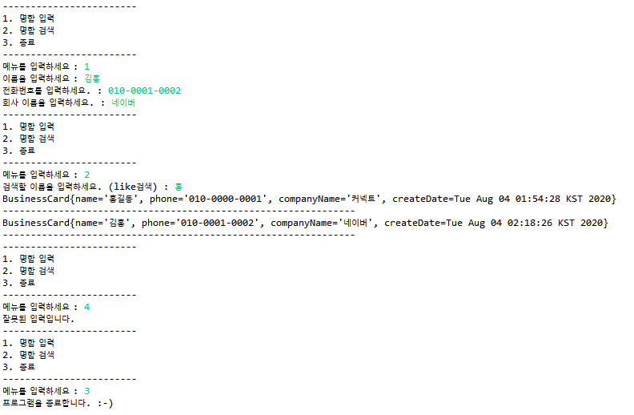

# SQL & JDBC 프로그래밍

# 프로젝트A. 명함 관리 프로그램

## 1) 개요

### 1. 프로젝트 개요

첫번째 프로젝트는 **CLI(Command Line Interface)**를 사용하는 명함관리 프로그램을 만드는 것입니다. 터미널(윈도우는 cmd창)상에서 동작하는 프로그램을 작성해야 합니다.

기능 요구사항은 다음의 기획서를 참고해 주세요. 기획서는 서비스 프로젝트에서 요구사항을 담은 내용이라고 생각하시면 됩니다.

- [기획서](https://www.edwith.org/downloadFile/fileDownload?attachmentId=402046&autoClose=true)


### 2. 프로젝트 개발 스펙

프로그램을 시작하면 메인화면이 보여져야 합니다.

#### 2.1. 기술 요구사항

- 메인 화면과 키보드 입력 부분에 대한 코드는 미리 주어집니다.
- 테이블 생성 스크립트 **ddl.sql** 을 프로젝트에 포함시켜 제출하세요.
- 제공된 **BusinessCardManagerDao**를 JDBC프로그래밍으로 구현하세요.


### 3. 프로젝트 개발과정 참고

#### 3.1. 개발환경

JDK 설치(ver 1.8)
이클립스 설치
tomcat설치(ver 8.5)
MySQL 설치

#### 3.2. 개발순서(BE)

1. MySQL 데이터베이스에 데이터베이스 사용자와 데이터베이스를 생성합니다.
2. 데이터베이스에 명함정보를 저장할 수 있는 테이블을 생성합니다.
3. 주어진 프로젝트를 이클립스에서 **maven import**합니다.
4. 해당 프로젝트의 **BusinessCardManagerDao**를 알맞게 수정하여 기획서의 내용과 같이 동작하도록 합니다.


### * 참고 자료

[cardmanager_미구현](https://www.edwith.org/downloadFile/fileDownload?attachmentId=402055&autoClose=true)

[Java Archive Downloads - Java SE 8](https://www.oracle.com/java/technologies/javase/javase8-archive-downloads.html)

[MySQL Download - MySQL](https://dev.mysql.com/doc/refman/5.7/en/installing.html)


## 2) 실행

### 1. Date

#### 1.1. Date to String

```java
String date = businessCard.getCreateDate().toString();
```

public String **toString()**

`Date` 객체를 다음의 형식의 `String` 로 변환합니다.

> dow mon dd hh:mm:ss zzz yyyy

다음에 각각의 의미를 나타냅니다.

- `dow` 는 요일 (`Sun, Mon, Tue, Wed, Thu, Fri, Sat`)
- `mon` 는 달 (`Jan, Feb, Mar, Apr, May, Jun, Jul, Aug, Sep, Oct, Nov, Dec`)
- `dd` 는 2 자리수의 10 진수인 달의 날 (`01` ~ `31`)
- `hh` 는 2 자리수의 10 진수인 날때 (`00` ~ `23`)
- `mm` 는 2 자리수의 10 진수일 때의 분 (`00` ~ `59`)
- `ss` 는 2 자리수의 10 진수인 분의초 (`00` ~ `61`)
- `zzz` 는 타임 존 (서머타임을 반영하는 경우가 있다). 표준 타임 존의 생략명에는,`parse` 메소드로 인식되는 것도 포함된다. 타임 존의 정보가 없는 경우,`zzz` 는 빈 상태(empty)에서, 문자는 포함되지 않는다.
- `yyyy` 는 4 자리수의 10 진수인 해

#### 1.2. String to Date

```java
SimpleDateFormat transFormat = new SimpleDateFormat("EEE MMM dd hh:mm:ss zzz yyyy", new Locale("us"));
String date = "Tue Aug 04 01:54:28 KST 2020";
Date createDate = transFormat.parse(date);
```

**SimpleDateFormat**을 이용하여 String에서 Date 형식으로 변환합니다.

포맷 형식은 아래와 같습니다.

| Letter | Date or Time Component                           | Presentation                                                 | Examples                                    |
| ------ | ------------------------------------------------ | ------------------------------------------------------------ | ------------------------------------------- |
| `G`    | Era designator                                   | [Text](https://docs.oracle.com/javase/8/docs/api/java/text/SimpleDateFormat.html#text) | `AD`                                        |
| `y`    | Year                                             | [Year](https://docs.oracle.com/javase/8/docs/api/java/text/SimpleDateFormat.html#year) | `1996`; `96`                                |
| `Y`    | Week year                                        | [Year](https://docs.oracle.com/javase/8/docs/api/java/text/SimpleDateFormat.html#year) | `2009`; `09`                                |
| `M`    | Month in year (context sensitive)                | [Month](https://docs.oracle.com/javase/8/docs/api/java/text/SimpleDateFormat.html#month) | `July`; `Jul`; `07`                         |
| `L`    | Month in year (standalone form)                  | [Month](https://docs.oracle.com/javase/8/docs/api/java/text/SimpleDateFormat.html#month) | `July`; `Jul`; `07`                         |
| `w`    | Week in year                                     | [Number](https://docs.oracle.com/javase/8/docs/api/java/text/SimpleDateFormat.html#number) | `27`                                        |
| `W`    | Week in month                                    | [Number](https://docs.oracle.com/javase/8/docs/api/java/text/SimpleDateFormat.html#number) | `2`                                         |
| `D`    | Day in year                                      | [Number](https://docs.oracle.com/javase/8/docs/api/java/text/SimpleDateFormat.html#number) | `189`                                       |
| `d`    | Day in month                                     | [Number](https://docs.oracle.com/javase/8/docs/api/java/text/SimpleDateFormat.html#number) | `10`                                        |
| `F`    | Day of week in month                             | [Number](https://docs.oracle.com/javase/8/docs/api/java/text/SimpleDateFormat.html#number) | `2`                                         |
| `E`    | Day name in week                                 | [Text](https://docs.oracle.com/javase/8/docs/api/java/text/SimpleDateFormat.html#text) | `Tuesday`; `Tue`                            |
| `u`    | Day number of week (1 = Monday, ..., 7 = Sunday) | [Number](https://docs.oracle.com/javase/8/docs/api/java/text/SimpleDateFormat.html#number) | `1`                                         |
| `a`    | Am/pm marker                                     | [Text](https://docs.oracle.com/javase/8/docs/api/java/text/SimpleDateFormat.html#text) | `PM`                                        |
| `H`    | Hour in day (0-23)                               | [Number](https://docs.oracle.com/javase/8/docs/api/java/text/SimpleDateFormat.html#number) | `0`                                         |
| `k`    | Hour in day (1-24)                               | [Number](https://docs.oracle.com/javase/8/docs/api/java/text/SimpleDateFormat.html#number) | `24`                                        |
| `K`    | Hour in am/pm (0-11)                             | [Number](https://docs.oracle.com/javase/8/docs/api/java/text/SimpleDateFormat.html#number) | `0`                                         |
| `h`    | Hour in am/pm (1-12)                             | [Number](https://docs.oracle.com/javase/8/docs/api/java/text/SimpleDateFormat.html#number) | `12`                                        |
| `m`    | Minute in hour                                   | [Number](https://docs.oracle.com/javase/8/docs/api/java/text/SimpleDateFormat.html#number) | `30`                                        |
| `s`    | Second in minute                                 | [Number](https://docs.oracle.com/javase/8/docs/api/java/text/SimpleDateFormat.html#number) | `55`                                        |
| `S`    | Millisecond                                      | [Number](https://docs.oracle.com/javase/8/docs/api/java/text/SimpleDateFormat.html#number) | `978`                                       |
| `z`    | Time zone                                        | [General time zone](https://docs.oracle.com/javase/8/docs/api/java/text/SimpleDateFormat.html#timezone) | `Pacific Standard Time`; `PST`; `GMT-08:00` |
| `Z`    | Time zone                                        | [RFC 822 time zone](https://docs.oracle.com/javase/8/docs/api/java/text/SimpleDateFormat.html#rfc822timezone) | `-0800`                                     |
| `X`    | Time zone                                        | [ISO 8601 time zone](https://docs.oracle.com/javase/8/docs/api/java/text/SimpleDateFormat.html#iso8601timezone) | `-08`; `-0800`; `-08:00`                    |


### 2. 오류

- Loading class `com.mysql.jdbc.Driver`. This is deprecated. The new driver class is `com.mysql.cj.jdbc.Driver`. The driver is automatically 
  registered via the SPI and manual loading of the driver class is generally unnecessary.

  - **MySQL 8** 이상은 `com.mysql.cj.jdbc.Driver`로 사용합니다. 

  ```java
  Class.forName("com.mysql.cj.jdbc.Driver");
  ```

- java.sql.SQLException: The server time zone value '���ѹα� ǥ�ؽ�' is unrecognized or represents more than one time zone. ...

  - **DB url**에 `serverTimezone`을 추가합니다.

  ```java
  // private static String dburl = "jdbc:mysql://localhost:3306/connectdb?useSSL=false&serverTimezone=UTC";
  private static String dburl = "jdbc:mysql://localhost:3306/connectdb?serverTimezone=UTC";
  ```


### 3. 실행 결과

